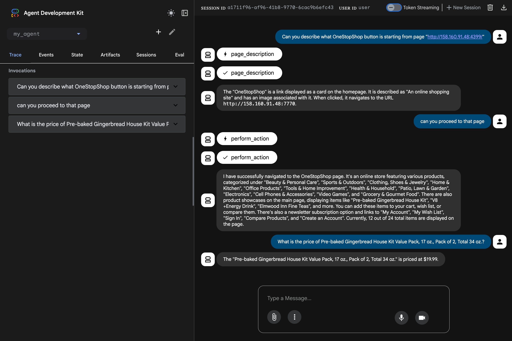

# Capstone project - WebArena MVP agent with google ADK

## The pitch:

Hello, My name is Artyom, I'm an independent researcher, lately I've been experimenting with [Webarena benchmark](https://webarena.dev/) for evaluating agent browsing capabilities in fixed environment. But the repo was about 10000 lines of code and not very reliable. So I decided to try to replicate its fuctionality with Google ADK. And here is my mockup.

## Core concept and value:

So when I started this project I saw dozens MCP options for data crawling, unfortunately none of them worked with my self-hosted benchmark webistes (probably of http path) so I wrote my own data crawling tools and imtegrated them with agent capabilities. 

The agent have two main functions - page description and action performance (like clicking buttons or links). With this setup I've been able to quickly finish first experiments and now planning to extend research. I also added additional logging to each of functions

## Setup:

1) ```pip install -r requirements.txt```
2) setup webarena websites (or use mine, I'll make them available for a couple of days after submission - http://158.160.91.48:4399)
3) install playwrigth to browse with python ```playwright install``` or ```npx playwright install```
4) ```adk web --port 8000``` or ```adk run my_agent```

## Results:

Here I'll leave some screenshots of what was achieved when testing. As you can see the Agent is able to successfully navigate through tree of links and extract price of the goods from second website.




Start page:


Seconary page:


